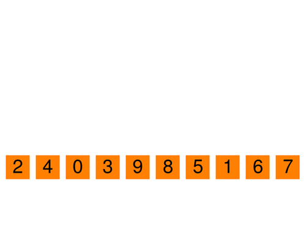

# Pygame-Sort: a tool for visualising sorting algorithms

## Running the program
1- Install python

2- Install pygame, for example by running `pip install pygame`

3- Run `python3 first_pygame.py <name of the algorithm to simulate> <no. of elements in array>`.

The program will generate a list of numbers from 0 to 9 and sort them using the algorithm specified.

If the number of elements is not set, the program will use 10 elements by default.
If the algorithm is not set, the program will use bubblesort by default.

## Supported algorithms (in-place)
- Bubble sort (arg = "bubblesort")
- Insertion sort (arg = "insertionsort")
- Quick sort (arg = "quicksort")

Further versions will include more algorithms, including not in-place ones.